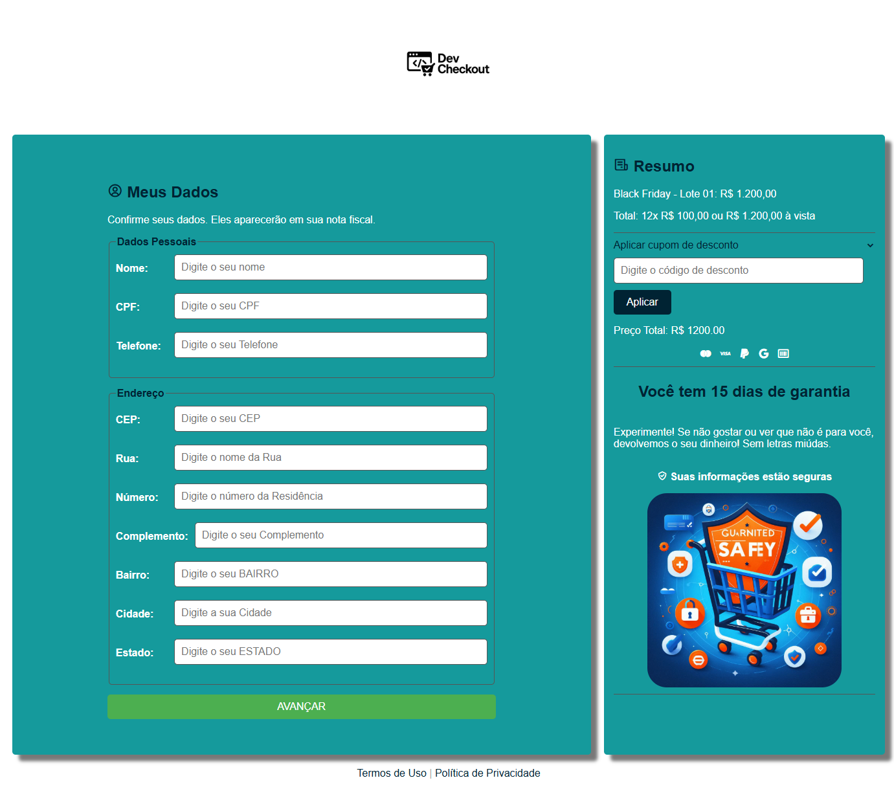

# 🛒 Sobre o DevCheckout

---

🛍️ **Sobre o DevCheckout**

DevCheckout é uma aplicação web desenvolvida para oferecer uma experiência prática e eficiente na finalização de compras online, com destaque para a integração de cupons de desconto. O sistema permite ao usuário inserir e aplicar cupons de maneira intuitiva, garantindo uma experiência de compra mais dinâmica e vantajosa.

---

## Funcionalidades principais:

🎟️ **Campo de Cupom de Desconto**: Permite que o usuário insira cupons para descontos exclusivos durante o processo de finalização de compra.

💳 **Checkout Simples e Eficiente**: Interface amigável que facilita a revisão do pedido e o pagamento.

🔐 **Segurança nas Transações**: A aplicação segue as melhores práticas de segurança para garantir uma navegação segura no processo de compra.

---

## Tecnologias

  
  
  

---

🎯 **Objetivo**

O objetivo do **DevCheckout** é simplificar o processo de finalização de compra em e-commerces, integrando um sistema de cupons de desconto e garantindo uma experiência rápida, intuitiva e segura para os usuários.

---

## Imagens

---

## 🤝 **Agradecimentos e Contribuições**

**Gostaria de agradecer ao HashtagTreinamentos pela formação e todo o apoio durante o desenvolvimento deste projeto.**

**Agradeço também aos contribuintes da comunidade open-source e todos que colaboraram para a evolução do DevCheckout!**
