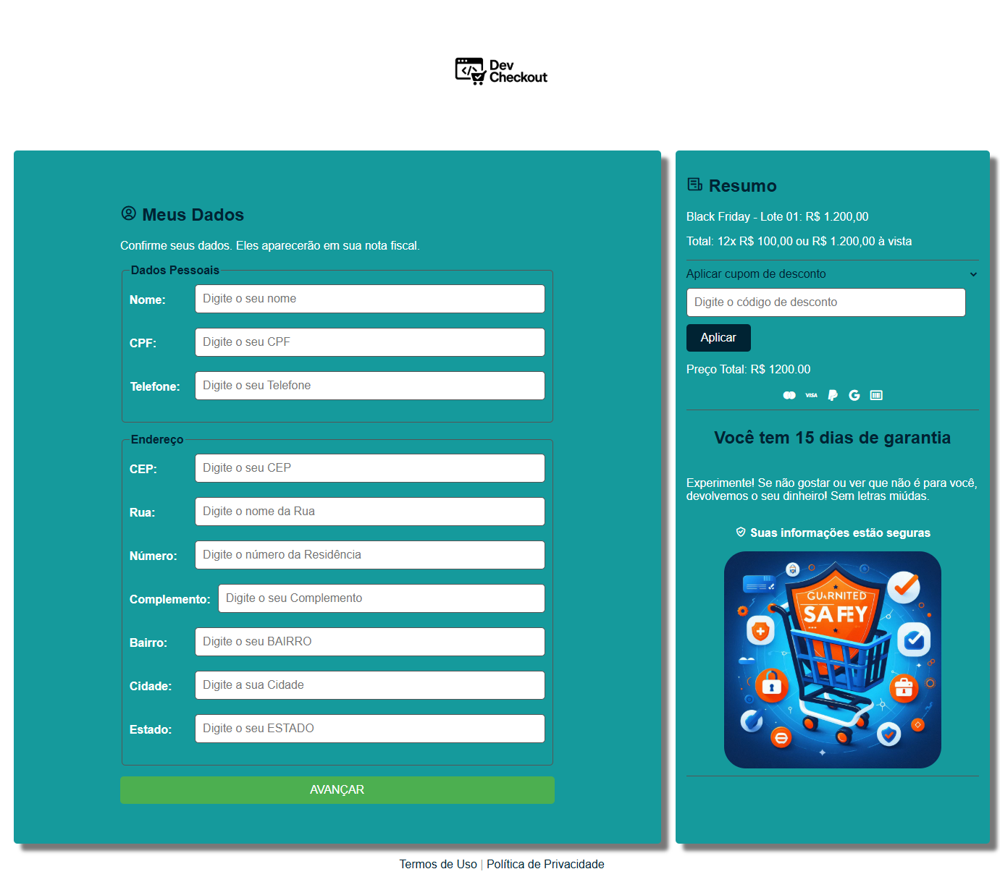

# 🛒 Sobre o DevCheckout

---

🛒 Sobre o DevCheckout
O DevCheckout é uma aplicação web simples e funcional voltada para simular uma experiência de página de checkout. Ideal para projetos de e-commerce, o sistema permite ao usuário revisar seus produtos no carrinho e aplicar cupons de desconto de forma prática e intuitiva.

---

⚙️ Funcionalidades

Cadastro de dados do usuário ao realizar o pedido

Campo para de cumpom de desconto

## Tecnologias

---

📌 Objetivo
Projeto criado com foco em aprendizado e demonstração de lógica básica de checkout com aplicação de cupons.

## Imagens

---

## 🤝 **Agradecimentos e Contribuições**

**Quero agradecer a uma das maiores escolas do Brasil para Desenvolvedore(a) que é o Hashtagtreinamentos**.

**E também muito obrigado a todos que fazem o Hashtagtreinamentos pela contruibuiçoes no desenvolvimento desse projeto**.
